# 高级数据管理

除了最基本的线路里程、标尺、车次时刻数据外，本系统还支持更加丰富的数据。这部分在最初接触软件时或许不大常用，但如果需要用到，可以参考本篇文档。

此文档已经更新至`V3.1.3`版本（2020年6月8日修订）。

## 列车数据

### 运行线管理

自本系统`2.0.0`版本开始，“车次”和“运行线”之间不再是一一对应的关系，而是**一趟列车可以有任意多的运行线**。这是从`1.x`到`2.x`版本的关键变化，也是本系统与ETRC系统的重要区别之一。一条**运行线**是指同一列车在本线上运行的一段连续、单向的区间，在图上用一条线表示。如图所示，

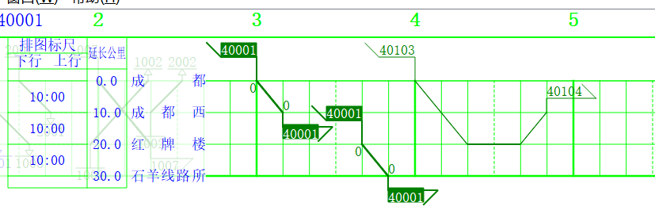

图中`40001`次成都-成都西区间，红牌楼-石羊线路所区间分别是两段运行线；图中`40103/4`次成都-红牌楼，红牌楼-成都西分别是两段运行线（因为运行方向变了）。这种情况下，40103次在成都-红牌楼间是下行，红牌楼-成都西间是上行，也即**上下行不是列车的性质，而是运行线的性质**。

当选中车次时，该车次的所有运行线都会被同时选中。例如上图中的40001次。

?> 虽然如此，但在绝大多数情况下所需要处理的运行线情况是比较简单的。这样的分段以及折返的情况是比较少见的。并且，对于大多数的情况，自动运行线管理已经能够处理的比较好，因此不必深究本节。但若要处理的情况比较刁钻，或者遇到问题，可以参考本部分。

运行线管理有两种方式，即**自动管理**和**手动管理**。一般情况下，我们建议使用自动管理，而仅仅用手动管理处理极其特殊的情况。

#### 自动管理

本节介绍运行线自动管理的逻辑。有关设置项是运行图设置中的**最大跨越站数**，参见[运行图显示控制](main/overview.md#运行图显示控制)。

对于没有设置过运行线规则的车次，系统**在铺画运行线时**，按照以下规则处理。

- 如果相邻的两个**可铺画站点**间跳过的车站数超过了“最大跨越站数”的设置项，则在这个区间断开运行线。

  > “可铺画站点”是指同时在<u>车次时刻表</u>和<u>本线站点表</u>中出现的站。最大跨越站数的统计，包含车次时刻表中不在本线的站和本线站表中<u>应该在而不在</u>车次时刻表中的站两部分。
  >
  > 例如，如果本线站表和车次时刻表中的站序如下表所示：
  >
  > | 线路站表 | 车次时刻表      | 匹配情况 |
  > | -------- | --------------- | -------- |
  > | 达州     | 达州 00:00      | 匹配     |
  > | 覃家坝   |                 | 不匹配   |
  > |          | 渡市 00:10/12   | 不匹配   |
  > | 三汇镇   | 三汇镇 00:23/25 | 匹配     |
  > | 土溪     | 土溪 00:40/...  |          |
  >
  > 则对于车次而言，达州、三汇镇是两个相邻的可铺画站点。两站点间的跨越站数为2。如果系统设置的“最大跨越站数”为1或者0，则达州和三汇镇间的运行线会断开。
  >
  > 对于当前方向而言，本应不通过的站不计入跨越站数。例如，对于上行的运行线而言，下行单向通过的站理应不在时刻表上，故不计入跨越站数。

- 如果区间运行方向改变，则断开运行线，且从折返站开始重新铺画运行线。上一段运行线不带结束标签，下一段运行线不带开始标签。因此从运行图上来看，运行线是连着的，但实际上是属于两段运行线。

- 如果按照前两段规则计算的某一段运行线中有效站数小于2，则取消这段运行线。

?> 这样的管理模式适用于时刻表较完整的情况，如果输入的时刻表是不完整的，例如只输入了停车站的时刻，其他站没有输入（但其实是经过了本线的，只是默认通过而没有填时刻），则按照自动运行线管理规则，运行线可能被断开。此种情况下，可将“最大跨越站数”设为一充分大的数字。

!> 引入运行线管理机制后，列车在本线运行的里程（及依据里程计算的均速）、列车入图出图方向等数据的计算都依赖于运行线信息。如果没有铺画过运行图，也没有手动给出运行线信息，则这些数据无法计算。

#### 手动管理

为了应对特殊情况，我们同样提供了运行线手动管理方式。手动管理方式见`当前车次设置`停靠面板（`ctrl+I`），在“运行线管理”栏，可以选择是否要自动管理。点击`设置`弹出对话框如下图所示。

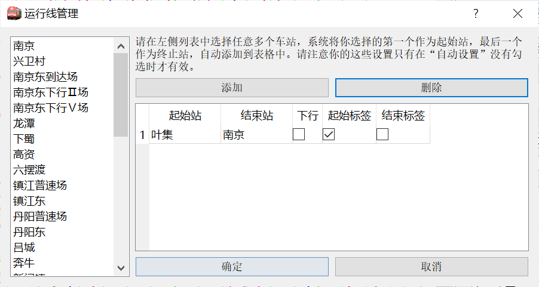

左侧显示的是本次列车的站点；右侧表中是运行线信息，一行是一条运行线，可以设置运行线方向，是否设置起始结束标签。

在左侧选择一组车站，点击“添加”后，将选择的第一个站至最后一站之间都作为一条运行线的数据。请注意运行线管理不可以重复，且必须按顺序添加。如果添加错误，只能删除再重新添加。

!> 此设置项仅在手动管理模式下生效。如果在自动管理下编辑，则重新铺画运行图时，手动管理的数据无效，且会被系统自动管理的内容覆盖。

?> 在手动管理模式下，系统铺画运行图后，仍会对运行线信息做一些调整，例如剔除掉不能在本线铺画的区段。但用户指定的分界点不受影响。

?> 一般来说，我们建议用自动管理，除非个别情况下自动管理失效，再用手动管理来调整。

### 列车类型系统

相比ETRC，pyETRC系统的一大特色是所有数据都要有依据，不会随意为用户指定参数，或者即使给了默认参数，也可以由用户调整。列车类型系统是这条原则的一个例子。列车的类型系统和是否为客车，都可以由用户规定。

?> 本系统已经预制了较为完整的国铁类型系统。正常情况下，无需用户修改。但如果用户需要添加自己的类型规则，或者不使用国铁类型系统（例如，用本系统来进行城市轨道交通运行图分析），则可以修改或重新设计类型系统，此时可以参阅本节内容。

#### 概述

列车类型系统主要包括两个方面，

- 列车种类。是指对于每一个车次，它属于哪一类车次，例如`快速` `特快`。列车种类有两种获取方式：
  - 针对每个车次手动设定。此项可在`当前车次设置`面板中设定。
  - 根据车次形式，使用**正则表达式**推定。详见后文。
- 是否为客车的属性。除列车种类外，所有车次还可分为`客车` 和`非客车`两大类。类似的，也有两种方式获取：
  - 针对每个车次手动设定。此项可在`当前车次设置`面板中设定。
  - 根据列车种类自动推导。可以规定每一种<u>列车种类</u>是否属于客车。详见后文。

#### 列车种类判定及其应用

本系统列车种类判定的**唯一**依据是`类型管理`功能设定的类型表。设置项见`运行图设置`停靠面板（快捷键`ctrl+G`），点击`类型管理`后的`设置`，弹出对话框如下图所示。

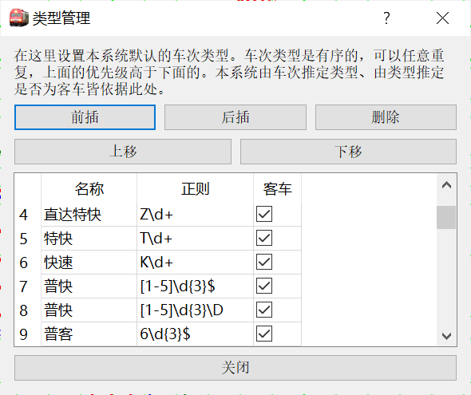

表中每一行是一个**种类判据**（名称可以重复），第二列是**全车次**应当符合的正则表达式。关于**正则表达式**（regular expression）的语法，请自行查阅有关资料。

表中各行的顺序表示优先级关系。当要对一趟车的全车次（例如：`5648/5`）做类型判断时，**从上到下依次**用正则表达式匹配，如果符合，则判定车次属于第一列所示的类型，并结束判定过程。

第三列规定该种类型是否属于旅客列车类型。

?> 在`当前车次设置`停靠面板中，如果`列车种类`一栏留空，则点击“确定”时，由本节所述规则判定种类。

?> 当修改客车类型系统时，已有列车的类型不会随之变化。通过菜单栏`工具->重置所有列车类型`可按现有规则，对现有所有车次，按照以上规则重新设置类型信息。

列车种类数据的应用主要体现在：

- 按列车种类筛选车次。详见[通用车次筛选器](main/review.md#通用车次筛选器)。
- 自动设置列车运行线颜色。在`运行图设置`和`系统默认设置`面板（参见[运行图显示控制](main/overview#运行图显示控制)），可以通过`默认颜色设置`指定各个类别车次所对应的默认运行线颜色。
- 选择要显示运行线的车次。详见[显示车次筛选](main/review#显示车次筛选)。
- 在[车站时刻表](main/review#车站时刻表)、[车次列表](main/overview#车次列表)等处显示，供用户参考。

#### 客货车判定及其应用

对某一车次是否为客车的判定主要依据的是类型系统中各个种类是否为客车的设置项，参见[列车种类判定及其应用](#列车种类判定及其应用)。

?> 在`当前车次设置`停靠面板中，如果`列车种类`后的`旅客列车`选择框为半选中（Partial Checked）状态，则依据列车种类，自动判定是否为客车。且这个判定是动态的，即如果改变了该种类是否为客车的选项，每个该种类下的车次都受影响。但若将此选项强制勾选或者不勾选，则不再受列车种类调整的影响。

?> 使用`工具->自动设置是否客车`可以对所有列车按照以上规则设置是否属于客车，**且这个判定是静态的**，即直接设定为“是”或者“否”，不再保留“自动”。理论上，进行本操作后，可以省去每次调用“是否客车”数据时的判定过程，但**此操作不可撤销**，需谨慎操作。

客货车判定目前主要应用于：

- 自动决定运行线宽度。即决定默认情况下使用`默认客车线宽`还是`默认货车线宽`。此设置项参见[运行图显示控制](main/overview#运行图显示控制)。
- 自动决定车站营业性质。详见[是否营业及其应用](#是否营业及其应用)。

## 天窗

本系统中的天窗数据仅作提示用，作为线路数据的一部分，可以在图上画出，但暂不包含更多的逻辑上的功能。本系统支持每条线路可以有两套标尺数据，即综合维修天窗和综合施工天窗。两套数据互相独立。

可从`窗口->天窗编辑`菜单，或者用快捷键`ctrl+1`（数字`1`）打开或隐藏天窗编辑停靠面板。编辑界面如下图所示。

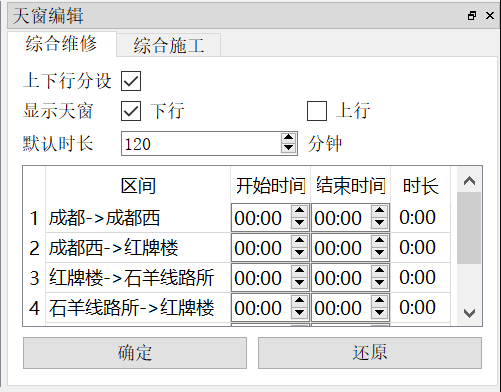

其中`上下行分设`选项的意义同[标尺数据](main/overview#标尺数据)中的相同选项。勾选或取消`显示天窗`，可控制显示/隐藏下行和上行天窗。天窗在运行图中的展示效果如下图所示。

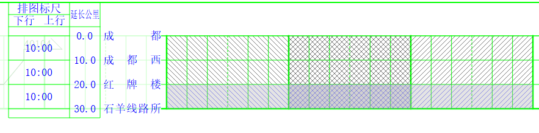

其中，下行天窗用左上->右下的阴影线标注，上行天窗为右上->左下，上下行交叉区段，或者上下行不分设的区段，则为交叉阴影线。上图中标注天窗的三个小时区间，自左向右分别为下行、上下行交叉、上行。

综合维修天窗用灰色阴影线，并无背景色；综合施工天窗在蓝色阴影线的基础上，添加浅灰色背景。上图中，成都-红牌楼区段为综合维修天窗，红牌楼-石羊线路所区段为综合施工天窗的样例。

#### 编辑技巧

考虑到输入时间比较麻烦以及天窗数据的一般规律性，我们在天窗编辑面板中设计了一些快速操作方法。这些快捷操作可以通过右键菜单调出，也可以用相应快捷键调用。具体如下：

- 复制本行数据到下一行（`Alt+C`）。将当前行数据复制到下一行，同时光标移动到下一行。
- 复制数据到本方向所有行（`Alt+Shift+C`）。重复上一项操作，直至本方向（上行或者下行）最后一行。也就是说，对于垂直天窗的情况，直接编辑第一行，然后用此功能复制就可以了。
- 计算结束时间（`Alt+E`）。按照表格上方设定的**默认时长**，根据本行设定的开始时间，加上默认时长，填写结束时间。适用于天窗时长基本固定但并非垂直天窗的情形，此时只需要编辑各个区间的开始时间，再用本功能计算结束时间。
- 计算开始时间（`Alt+R`）。和<u>计算结束时间</u>类似，只是本功能通过结束时间，反推开始时间。
- 计算所有结束时间（`Alt+Shift+E`）。对每一行应用<u>计算结束时间</u>。
- 计算所有开始时间（`Alt+Shift+R`）。对每一行应用<u>计算开始时间</u>。

## 标尺

本节将给出关于标尺数据的更多相关逻辑和操作。关于标尺数据的最基础部分和编辑方法，我们已经在[基础功能](main/overview#标尺数据)中介绍过了，这里不赘；但出于基础功能页的篇幅考虑，将更多的细节部分放到这一篇文档中来。

### 单车次标尺读取

我们首先介绍一下本系统初期最常用的标尺快速获取方法，即从一个指定的车次中读取标尺数据。

?> 需说明，这里讲的**单车次**乃是指**每次**仅能读取一个车次，但并不妨碍多次进行这个操作。

在标尺编辑面板点击`从车次读取`，弹出对话框，如下图所示：

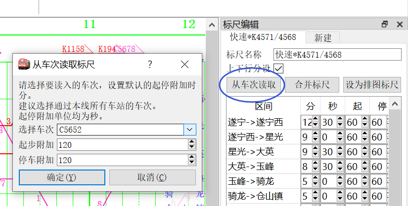

选择本运行图中的一个车次，规定起步附加时分和停车附加时分，计算一套**完全适合于所选车次和所设附加时分**的标尺。

具体说来，程序对于该车次经过的每一个本线**邻接**区间，计算该车次在这个区间的运行时长，

- 如果该车次在该区间前站始发或者停车，则从时长中扣去所设的起步附加时分；
- 如果该车次在该区间后站终到或者停车，则从时长中扣去所设的停车附加时分，

剩下的运行时长即为本区间的通通时分；本区间的起步附加时分和停车附加时分皆为所设值。

!> 所选车次覆盖的区间的标尺数据将被**无条件覆盖**为该车次的数据。

?> 注：**邻接区间**是指，该车次时刻表在区间两站间可以有非本线经过的站，但不能跨越本线的另一站，否则得不到数据。举例说来，设本线站表的三个相邻站为`A-B-C`，若所选车次经停站顺序为`A-B-D-C`，则`A->B`， `B->C`两个区间的时分数据都能得到（但由于中间站的存在，未见得准确）；又若所选车次经停站顺序为`A-C`，则这两个区间都得不到数据。

### 多车次标尺综合

单车次标尺读取的局限性是非常明显的：

- 其结果受限于单个车次，如果该车次的时分有些问题，比如有慢行附加，则数据也不准确。
- 严重依赖于用户输入的起步附加时分和停车附加时分，且各个区间只能用相同的值。实践表明，即使是同一条线的同一类标尺，在各个区间的起停附加时分往往不完全一样，由此将导致明显的系统误差。
- 对于没有贯通车次的长线，只能逐段读取，工作量略大。

实践也证明，用这种方式读出来的标尺往往是不准确的，当使用标尺对照功能检查时，相同标尺下的车次（除去读取标尺所用车次）运行数据通常都不能与标尺完全吻合。

基于这些问题，为了得到尽可能可靠的标尺数据，本系统在`3.1.1`版本新增了这个功能，通常`多车次标尺读取`，或者`标尺综合`等。菜单栏位于`工具->多车次标尺读取向导`，工具栏位于`线路->标尺综合（大图标）`，快捷键为<kbd>Ctrl</kbd>+<kbd>Shift</kbd>+<kbd>B</kbd>。

本节我们首先解释本功能基于的假设和数学原理，然后说明本功能的使用方法。没有兴趣的读者可以跳过数学原理部分。要理解数学模型，需要一点**线性代数**基础（但要求不高）。

#### 数学模型与解释

众所周知，列车区间运行标尺由区间通通时分、起步附加时分、停车附加时分三部分组成，我们在下面的讨论中，用$x, y, z$来分别标记这三个部分。显然任何实际情况下总会有通通时分；按照是否有起步附加、停车附加一共可以组合出4种实际情况，也即`通通, 起通, 通停, 起停`。在下面的讨论中，用$a, b, c, d$来分别标记这四个数据。

如同一般的情况，我们假定**起步附加时分与停车附加时分是独立的**。也就是说，一个车次是否有起步附加时分与其是否有停车附加时分之间是没有关系的。进一步，我们假设**每个车次在各个区间的运行标尺是独立的**，因此我们可以容易的把问题分化为各个小区间的标尺读取问题。

对于一个小区间（相邻两站之间的区间），理想情况下，用公式可以表示为

$$
\begin{split}
a=x\\
b=x+y\\
c=x+z\\
d=x+y+z
\end{split}
$$

或者可以写成矩阵形式：

$$
\begin{pmatrix}
a\\
b\\
c\\
d\\
\end{pmatrix}
=
\begin{pmatrix}
1 & 0 & 0\\
1 & 1 & 0\\
1 & 0 & 1\\
1 & 1 & 1
\end{pmatrix}
\begin{pmatrix}
x\\
y\\
z
\end{pmatrix}
$$
我们记：

$$
\alpha = (a,b,c,d)^T,
\gamma = (x,y,z)^T,A=
\begin{pmatrix}
1 & 0 & 0\\
1 & 1 & 0\\
1 & 0 & 1\\
1 & 1 & 1
\end{pmatrix}
$$
则上式可以简单记为

$$
\alpha = A\gamma
$$
我们的问题是，给定一组$\alpha$数据，计算$\gamma$向量。

在理想的情况下，同一个区间同一个标尺下的所有车次的运行数据应当相同，也就是说，每一类下应当只有一个数据（例如，所有`通通`车次都是300秒，所有起通车次都是360秒），在这种情况下，无论多少个车次，总能写成如上的四个方程的线性方程组，且其满足$\mathrm{rank} (A|\alpha)=\mathrm{rank} A=3$，方程有唯一一组解。但实际情况是复杂的。我们需要考虑：

- 不同车次之间可能存在误差。这个误差来源很多，比如慢行附加，或者这个车次并不属于要推导的这个标尺，但被用户错误的选取进来；
- 并非每个区间都同时具有四种起停附加情况（举例来说，在一个区间包含必停站时，例如`成都东`至`石板滩`这个区间，所有车次在成都东不可能是通过的情况，因此至多也只能有`起通，起停`这两种情况）。当四种情况中只有1种或者2种被覆盖时，需要引入经验数据来完成计算（相当于补充一个方程）。

自然，只要数据覆盖了3种及以上的情况，我们总可以解出一组近似的值，直接用**伪逆**即可实现。但这样计算量过大，结果常常也不能回避干扰数据。因此我们考虑正式求解方程组之前，**对每一类数据做约化**，只保留至多一个数据。

?> 考虑到效率问题，我不打算在本项目中引入科学计算库，例如`numpy`之类的，因为它们体积比较大，导入和编译为`win64`版本都需要较多的时间，这个代价对于我们的应用来说，是不必要的。

本系统设计了两种数据筛选算法，具体由用户来选择和配置：

1. **众数模式**。对每种情况的数据，简单的选择**出现次数最多**的那个数据作为这种情况的最终数据。如果出现两个以上出现次数相同的数据同时为最多，我们简单的选取**时间最短的那个**。

   ?> 解释一下这样设计的理由。基于的考虑是要使得最终计算出来的标尺满足（完全匹配到）尽量多的车次。由于取平均数的方法容易导致取到大家都不能满足的数据与此违背，因此对于并列最多的数据，我们武断地选取最快的那个，而不是用看起来更加合理的取平均方法。

2. **均值模式**。用户可以指定数据截断标准差倍数，或者秒数，或者不使用截断。对于每一种情况的数据，记车次总数为$N$,每个车次的区间运行时分为$X_i(i=1,2,\cdots N)$。我们首先计算样本均值和样本标准差

   $$
   \bar{X}&=\frac{1}{N}\sum_{n=1}^{N} X_i\\
   S&=\sqrt{\frac{1}{N-1}\sum_{n=1}^{N}(X_i-\bar{X})^2}  ~~~~~(N>1)
   $$
   对于样本中距离均值最远的那个数据$X_P$，如果用户指定截断秒数$S_{cut}$，且

   $$
   |X_p-\bar{X}|>S_{cut}
   $$
   或者用户指定截断标准差倍数$a_{cut}$，且

   $$
   |X_p-\bar{X}|>a_{cut}S
   $$
   则舍去数据$X_p$。重复这个操作，直至只剩下一个数据，或者没有新的数据需要被舍弃为止。然后选取最终的$\bar{X}$作为这种情况下的数据。

现在我们考虑每一类只保留一个数据之后的方程组。这时我们有至多4个，至少1个方程（不会是0，因为无数据的区间将被直接舍弃不算）。对于不同方程数量的处理会有些许不同，我们分类讨论。

**首先考虑四个方程都具备的情况**。在一般的数学问题中，显然增广矩阵$(A|\alpha)$的秩与矩阵$A$的秩相等时，方程才有唯一解。在我们的问题中，矩阵$A$是确定的，因此其秩也是确定的$\mathrm{rank} A=3$。理想情况下，增广矩阵的秩也确实该是3. 但在实际的情况中，由于不同车次的标尺可能有误差，这将可能导致$\mathrm{rank} (A|\alpha)=4$，不存在同时满足四个方程的解。此时我们有两种处理方案。

1. 采用伪逆求解。即

   $$
   \gamma = (A^TA)^{-1}A^T \alpha
   $$
   由于矩阵$A$是完全确定的，所以其伪逆也是完全确定的

   $$
   (A^TA)^{-1}A^T= \begin{pmatrix}
   0.75 & 0.25 & 0.25 & -0.25\\
   -0.50 & 0.50 & -0.50 & 0.50\\
   -0.50 & -0.50 & 0.50 & 0.50
   \end{pmatrix}
   $$
   在这个矩阵可以硬编码到程序里，计算代价不会很高。
   
2. 从四个方程中，选择一个去掉，然后归约为三个方程的情况来求解。

在实际操作中，如果用户选择的是**众数模式**，则总是去掉一个方程，使用剩余的三个方程求解。去掉方程的原则是：

- 如果四个方程对应的情况（四种停车附加情况）中，存在**一个**出现次数最少的（i.e. 最少的不是并列），则直接去掉次数最少的情况对应的数据。
- 否则，去掉<u>能够使得去掉该数据之后，最终计算的区间标尺最快</u>的那个数据。

如果用户选择的是**均值模式**，则采用伪逆求解。

?> 特别说明，以上是3.1.3版本修订的逻辑。在此前的版本中，在众数模式下，如果出现次数最少的数据存在并列，则用伪逆方法求解。此处的逻辑修订基于与前面提到的一样的理由，即我们希望，众数模式下计算出来的标尺**至少能完全适合一部分车次**。

**然后考虑三个方程的情况**。容易证明，矩阵$A$中任意拿掉一行产生的新矩阵$B$的秩都为$3$，则可以很容易地利用求逆方法得到解：
$$
\gamma = B^{-1}\alpha
$$
本系统实现中，基于效率考虑，将四种情况的矩阵$B$的逆矩阵全部提前解出，硬编码在代码中。由于各种情况很明确，这里不具体列出。

**在考虑两个方程的情况**。按照具体是哪两种数据，可以分为6种情况，且每一种情况都要引用用户预先指定的默认起步附加时分、默认停车附加时分中的一个。这相当于引进一个新的方程。在有的情况下，引入哪一个数据是完全确定的（我们将在下面举一个例子）；但有的情况下，引入两个数据都能得到解，这种情况下，我们**优先引用默认起步附加时分**。

我们现在列出所有的六种情况。其中，默认起步附加时分和默认停车附加时分用$m,n$标记；$a,b,c,d$的含义按照本节开头的约定。

1. 有数据的是$a,b$。这时显然应该引用$n$数据。因为从$b-a$已经可以直接得出$y$数据，再引入$m$就是多余的了。这种情况下，我们得到的解是：
   $$
   x=a\\
   y=b-a\\
   z=n
   $$
   在下面的情况中，我们不再详细求解，而只说明用了哪个数据。
   
2. 有数据的是$a, c$，引入数据$m$。

3. 有数据的是$a,d$，数学上可以引入$m,n$之一，我们按照约定，优先引用$m$。

4. 有数据的是$b,c$，数学上可以引入$m,n$之一，我们采用$m$。

5. 有数据的是$b,d$，引入数据$m$。

6. 有数据的是$c,d$，引入数据$n$。

**最后考虑只有一个方程的情况**。这时两个用户给出的数据$m,n$都需要使用。

#### 操作指引

这部分文档将逐步说明多车次标尺综合的操作过程。前四步合并到一张图上：

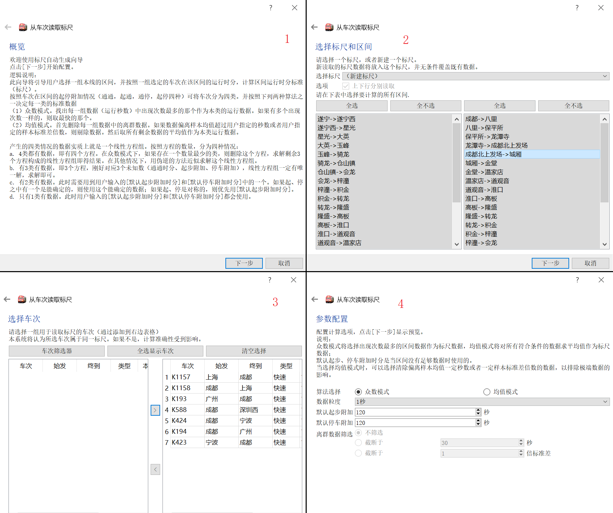

打开本功能会弹出如上图1所示的向导首页。这一页比较详细地说明了本功能的逻辑，本文档的上一节也基本上说过了，这里不再重复。点击`下一步`开始配置参数。

**在图2所示步骤中**选择要读取标尺的区间和结果保存的标尺。可以选择一个现存的标尺来保存数据，也可以选择新建一个标尺。

!> 当选择现存标尺时，新读取的区间数据将覆盖原有数据。

`上下行分别读取`选项对应于标尺编辑中的`上下行分设`选项。这就是说，如果是添加到既有标尺，则这一选项只能与既有标尺相同，不能修改；另一方面，如果本线存在上下行分设站，标尺数据也必须是上下行分别读取的，不能修改。

下方的两个表格分别是下行和上行的所有区间（如果`上下行分别读取`没有勾选，则右侧表不可用）。**通过多选选择所有要读取标尺的区间**，然后点击`下一步`。

**在图3所示步骤中**配置用于读取数据的车次列表。**左侧列表是候选车次，右侧列表是已选车次**。`车次筛选器`作用于左侧的候选列表（操作方法详见[通用车次筛选器](main/review#通用车次筛选器)），它只决定是否显示，而不会直接添加。在左侧多选，然后点击中间的`>`按钮将其添加到右边；在右边多选并点击`<`可取消所选车次。

`全选显示车次`将当前左侧**显示的**所有车次添加到右边；`清空选择`将清空右侧列表。

?> 必须选择至少两个车次才能进入下一步。如果只选择一个车次，则本功能的逻辑与[单车次标尺读取](#单车次标尺读取)无异，无需用这个向导。表格支持排序。

!> 本功能的逻辑指出，此处选择的一组车次需要时具有相同运行标尺的；或者说本系统假定这一点成立。当然，如果选择属于不同标尺的车次，仍可得到结果，但结果准确性受到影响。

**在图4所示步骤中**配置一些细节的计算逻辑。

`算法选择`目前支持众数和均值两种模式。这个选项用于从一组同区间、相同起停附加状况的数据中，选出一个数据作为这种情况的最终数据。具体的含义请参见上节。

`数据粒度`是指结果保留到什么精度。一般来说标尺的尾数很少是`23秒`之类的，因此可以将计算结果强制修约到指定精度，以适应实际需要。提供的选项有1秒、5秒、10秒、15秒、30秒、60秒。

`默认起步附加` `默认停车附加`配置在数据不足以算出起步附加、停车附加的情况下使用的缺省值。关于什么情况下使用这里的数据，请参阅上节。

当选择用`均值模式`时，还可以选择一种方式来筛选离群数据，以排除极端数据的影响（举例，可能有的车次区间绕行离开了本线，区间运行时分长达几个小时，这种情况下如果不加以排除，显然会严重影响计算结果）。有按照偏离中心（样本均值）的秒数和**样本标准差**倍数两种排除算法。具体的排除算法，请参阅上节。

点击`下一步`进入预览界面，如下图所示（由于前面的例子过于简单，这张图和上面那张图不属于同一个运行图，不是同一次操作的截图）。

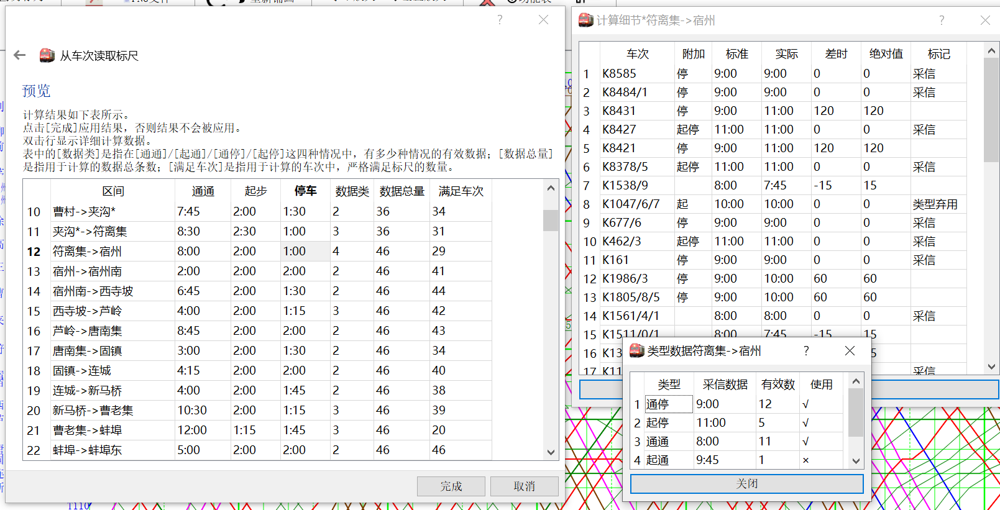

预览界面显示各个区间的计算结果（如上图左侧）和简单的计算过程数据。

`数据类`指的是本区间可用数据中包含`通通，起通，通停，起停`四种起停附加组合情况中的几种。显然，取值范围是1至4.

`数据总量`给出的是**未被舍去**的数据总量。对于众数模式，此数据总是显示总量（而不是最多那个数据的出现次数）；对于均值模式，此数据减去了被截断的离群数据的数量。

`满足车次`指**所选车次中**完全符合（精确到秒的符合）计算出标尺的车次数量。

通过右键菜单第一项，或者双击表项，将弹出`计算细节`对话框，如上图右上所示，从车次视角显示计算的详情。

其中，`标准`列是指按照计算出标尺算出的标准区间运行时分；`实际`列是该车次在本区间的实际运行时分；`差时`是用实际运行时间减去标准运行时间所得的**秒数**。`绝对值`是指`差值`的绝对值，为了方便排序。

在众数模式下，`标记`列有两种，即`采信`和`类型弃用`。前者表示应用此数据为标准数据；后者表示此类型（起停附加状况四种之一）被弃用，没有代入最终的方程来计算。详细逻辑请参见上节。在均值模式下，只有一种标记，即`截断`，标识该车次的数据被判为离群数据而舍去，将不计入`数据总量`。

通过右键菜单第二项，可打开`类型数据`对话框，如上图右下。此对话框按照起停附加的四种类型视角统计数据。在众数模式下，`有效数`指的是出现最多的那个数据的数量；在均值模式下，这个数据是指没有被排除掉的数据。`使用`只在一种情况下可能是`×`，即上面所述的`类型弃用`的情况。

?> 注意，执行到这一步时，并没有将数据添加到标尺。需要点击`完成`后才会确认。此时若点击`取消`退出，将不产生效果。

点击`完成`退出向导。如果选择的是新建标尺，则会弹出对话框，输入新标尺的名称，输入一个不重复的即可。也可选择取消，由系统自动命名为`新标尺x`，`x`为从0开始的数字。

### 标尺排图详细逻辑

在[基础功能](main/overview#按标尺排图)中，我们简要说明了按标尺排图（作为纵坐标标度）的规则。由于基础功能文档需担任入门指引的作用，不宜太过复杂，因此该文档中我们简单的把对标尺的要求概括为标尺需完备。本节将更详细的说明标尺排图的逻辑，并将看到，对标尺的要求可以适当放宽。

按里程和按标尺排图是两种纵坐标的确定方法，其本质要求在于要**能够确定每一个(需铺画的)站的纵坐标**。

?> 在本系统的早期测试阶段，曾经试过使用混合坐标，即在标尺数据不足以确定坐标时，所缺站用里程数据来确定。但这样导致逻辑复杂化容易出错，另一方面使得总长很难确定。因此本系统自正式发行起，就不允许用混合坐标比例，而是要求必须**仅通过**所给标尺数据就能确定每个站的坐标，才能用标尺排图。

本系统按标尺确定纵坐标的过程是：

1. 计算整个标尺**下行方向**的总通通时分。也就是说，从第一站到最后一站，按照下行标尺，不附加任何起停附加时分情况下的时长。如果中间有区间缺数据导致无法算出总时长，则排图失败，报错。

2. 按照用户指定的`纵轴每像素秒数`参数（见[运行图显示控制](main/overview#运行图显示控制)），换算出对应的纵向像素数，也即运行图总高度，同时也是最后一个站的纵坐标。

3. 第一站纵坐标为0. 从第一站开始，按照**下行方向**，对每一个**下行方向通过的站**，计算前一站到该站的**通通时分**，按照`纵轴每像素秒数`计算出坐标偏移量，这样就递推地确定了所有下行通过的站的纵坐标。如果有一个区间没有数据，则排图失败，报错。

   ?> 由于我们强制性要求首站和末站必须设为`上下行通过`，所以只要这部分标尺数据完备，总能确定所有下行通过站点的位置。

   对于非上下行分设的标尺，或者不存在上下行分设站的线路，排图到这里就结束了。

4. 补充上行单向站点。上一步已经确定了所有下行通过、上下行皆通过站点的纵坐标，现在只需要补充上行单向站的位置。对于每个**仅上行通过**的车站，向上行端找到最近的上下行通过站（记为$A$），再向下行端找到最近的上下行通过站（记为$B$）。

   ?> 由于我们强制性规定了首站和末站必须是上下行都通过的，所以上述的A, B站一定能找到。这也是本系统做这个限制的主要原因。

   对$B$->$A$区间内的**所有**上行通过站，记为$C_1, C_2, \cdots$，计算每一个小区间（$B$->$C_1$, $C_1$->$C_2$,$\cdots C_n$ ->$A$）的**上行通通时分**，按照上行通通时分的**比例**分配$A$->$B$的纵坐标长度，从而确定这个区间内的所有上行单向站的位置。如果上述要求的区间数据中有任何一个缺失，则排图失败，报错。
   
   至此，标尺排图过程结束。

从上面的过程，可以总结一些标尺排图的性质：

- 标尺排图过程以**下行**标尺为主（在上下行标尺分设时）。下行通过的各个区间都是（在不考虑量化误差的情况下）严格按照**下行标尺通通时分**比例安排的。这将导致，如果有一个下行车次严格符合排图标尺，并在所有站都通过，则其运行线在本线是严格的直线段（不考虑量化误差的情况下）。
- 任何情况下都不考虑起停附加时分，也就是引用的数据总是通通时分，即使某个区间所有车次都有某项附加时分。这将导致，严格符合排图标尺的下行车次，在有起停附加的区间，其斜率（绝对值）会比其他区间小一些。
- 上行单向站位置只能保证在其上下行最近邻的两个双向通过站之间的子区间是按照上行标尺比例铺画的；其他情况下，上行标尺并未被考虑。因此这将导致，严格符合排图标尺且无起停附加的上行车次运行线可能并非是严格的直线段。特别的，在一些上下行分离明显的线路中，例如襄渝线安达段、陇海线宝天段，上行运行线将出现明显的转折。
- **设置为`不通过`的站不会被铺画**。这一点是与按里程排图时显著不同的。按里程排图时，即使将一个站的设置成上下行都不通过，还是可以通过里程确定出车站坐标，因此只要用户没有显式指明不铺画这个站（取消`显示`列的勾选），本系统仍然铺画其运行线。然而，按标尺排图时，由于不通过的站不会作为任何标尺区间的端点，其位置完全无法确定。因此不会被铺画，并且即使有车次的时刻表上有这个站，也会被忽略。

从铺画的逻辑，我们还可以对排图标尺的要求作出更明确的解释。

- 在上下行不分设的标尺中，要求每个区间数据完备。
- 在上下行分设的标尺中，要求下行每个区间数据完备，且每个上行单向站（如果存在）到其上行、下行端最近邻的两个双向通过站之间的标尺是完备的。

## 车底交路

### 概述

本系统允许每趟车属于**至多一个**车底交路。之所以强调车底交路，是为了和机车交路相对应，也就是仅能有至多一个交路，而不能分段设置（即换挂）。

一个交路是一组车次的序列。序列中的车次可以是属于本运行图的车次，也即本运行图中有该车次的时刻信息，称为**实体车次**；也可以是不属于本运行图的车次，也即**虚拟车次**。

### 交路编辑界面

使用菜单`窗口->交路编辑`或者快捷键`ctrl+4`可以打开或者隐藏交路编辑停靠面板。在交路编辑面板中双击一行，或者点击`编辑`或`添加`，弹出针对单个交路进行编辑的对话框。交路编辑停靠面板及对话框的界面如图所示。

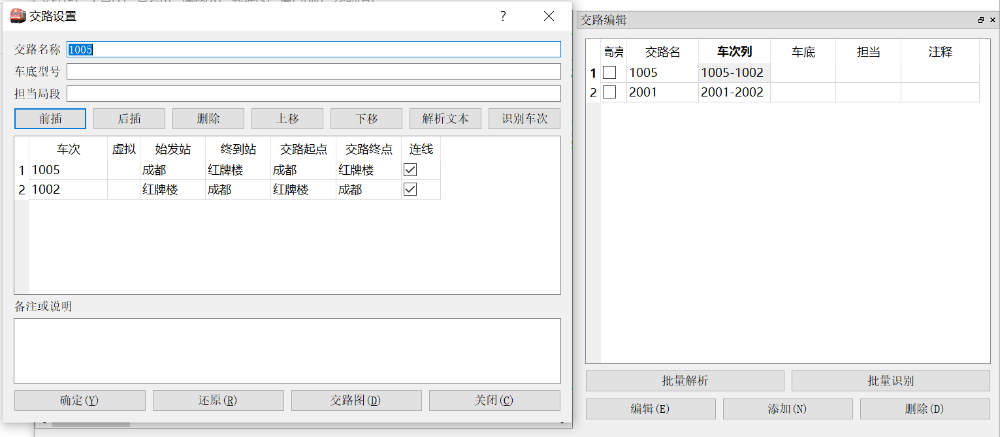

其中，`交路名称`必须是唯一的非空字符串；而`车底型号` `担当局段` `备注或说明`则可以是任何内容，仅作提示用。

`识别车次`的作用是重新判定实体车次与虚拟车次。这将遍历所有车次，对于符合实体条件的车次（即本运行图中可以找到该车次的时刻信息）则设置为实体车次；否则设置为虚拟车次。实体车次和虚拟车次的来源参见[添加车次](#添加车次)和[交路字符串解析](#交路字符串解析)。`批量识别`将对所有交路应用以上操作。

`解析文本`和`批量解析`详见[交路字符串解析](#交路字符串解析)。

`连线`选项指出是否希望在该车次的运行线**开始处**绘制与上一车次之间的连接线。具体逻辑参见[运行线连接](#运行线连接)。

勾选`高亮`，可将该交路中所有车次（及车次连接线）都加粗显示出来，显示效果同选中车次。

### 添加车次

在交路设置的对话框中点击`前插`或者`后插`则弹出添加车次的对话框。添加车次分为添加实体车次和虚拟车次两种情况。添加实体车次的界面如下图所示，

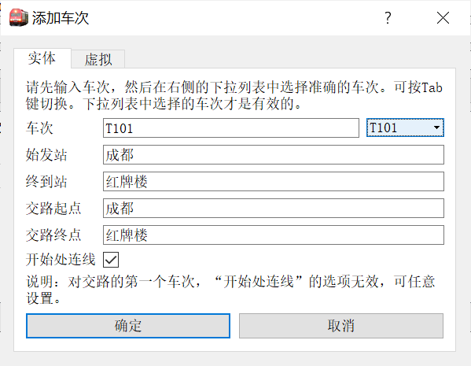

首先在`车次`栏输入，按`Tab`键后，右侧的下拉菜单中弹出符合条件的车次，默认选中第一个，并自动填写始发站、终到站等信息。点击`确定`即可完成插入。

!> 只有下拉菜单中选中的车次才是有效的。如果找不到车次，或者选择的车次已经属于一个交路，则弹出告警信息。此时不能插入车次。

?> 极个别情况会出现数据不同步的情况。也就是车次并不属于某个交路，但因为某些操作，导致无法添加到交路，提示“该车次已经属于xxx交路”。这种情况下，可以到`当前车次编辑`（`ctrl+I`）面板中，点击`车底交路`后的`清除`来强制删除。

虚拟车次的插入比较简单，只需要输入有关信息即可，不再附图。请注意插入时并不会检查车次是否唯一，也不会检查车次是否属于当前运行图。

### 运行线连接

运行线连接和股道占用分析是交路数据的两项最重要的应用。这里介绍运行线连接的逻辑。股道占用分析详见[车站股道图](main/review#车站股道图)。

运行线连接是指，当交路前后相邻的两个车次符合一定条件时，在运行图上以虚线连接其运行线端点，如下图中`1005`次与`1002`次之间的连线所示。

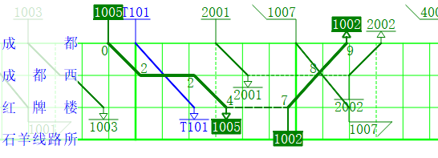

两车次间绘制车次连接线，**当且仅当**下列条件**同时**满足：

- 两车次是同一车底交路中的两个相邻车次。

- 添加车次时，或在交路设置界面，勾选了`开始处连线`或者`连线`选项。

- 前序车次和后序车次在**本线**同一车站终到、始发。

  ?> 关于终到、始发站的判定，可参见[始发终到站匹配规则及其自动适配](main/modify.md#始发终到站匹配规则及其自动适配)，或者也可以简单地理解为，前序车次的`终到站`设置项必须和时刻表最后一个站相同，后续车的`始发站`设置项必须和时刻表第一个站相同，且这两个站都是**本线**同一个站。

交路连线采用虚线，颜色同**后续车**的运行线颜色，且虚线叠压在车站水平线上。

### 交路字符串解析

除了手工一个个添加车次到交路外，本系统还支持从特定格式的交路字符串解析交路的功能，这也是用文字表述交路的一般方法。交路应当是以一定分隔符分开的车次串，例如

```
D354/1—上海虹桥入库—D352/3—成都东入库—D354/1
```

分隔符可以由用户指定，或者用默认的`-` `—` `~`三种之一，但同一次解析中，分隔符只能有一种。含有`入库` `过夜`等关键词的分隔项目，将被排除掉；如果最后一个车次和第一个相同，也将被排除掉。如上例中的交路将解析为：

```
D354/1—D352/3
```

如果车次能在本运行图中找到时刻信息，且没有属于其他交路，则判定为实体车次；否则为虚拟车次。

交路解析有两种方式。

#### 单交路解析

在交路设置页面中，点击`解析文本`弹出对话框，如下图所示。

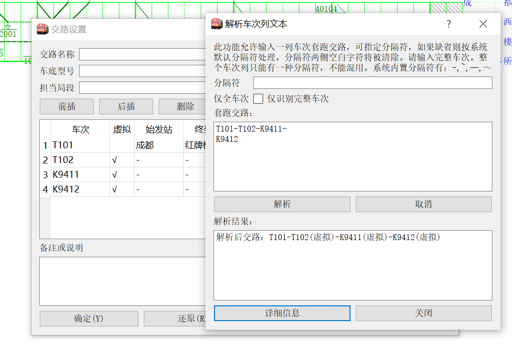

在`套跑交路`中输入字符串即可解析。输入中**可以换行**，换行符将被忽略。点击`解析`显示结果，同时插入到交路中。若点击`详细信息`，则可看到每个车次解析的具体情况，上例中的详细信息为

```
[info]在交路None中解析车次信息字符串
[info]添加实体车次Train T101 (成都->红牌楼) 
[warning]车次T102不存在，设为虚拟车次
[warning]车次K9411不存在，设为虚拟车次
[warning]车次K9412不存在，设为虚拟车次
```

#### 批量解析

从菜单栏`工具-批量解析交路`或者快捷键`ctrl+P`可以打开批量解析对话框，如下图所示。

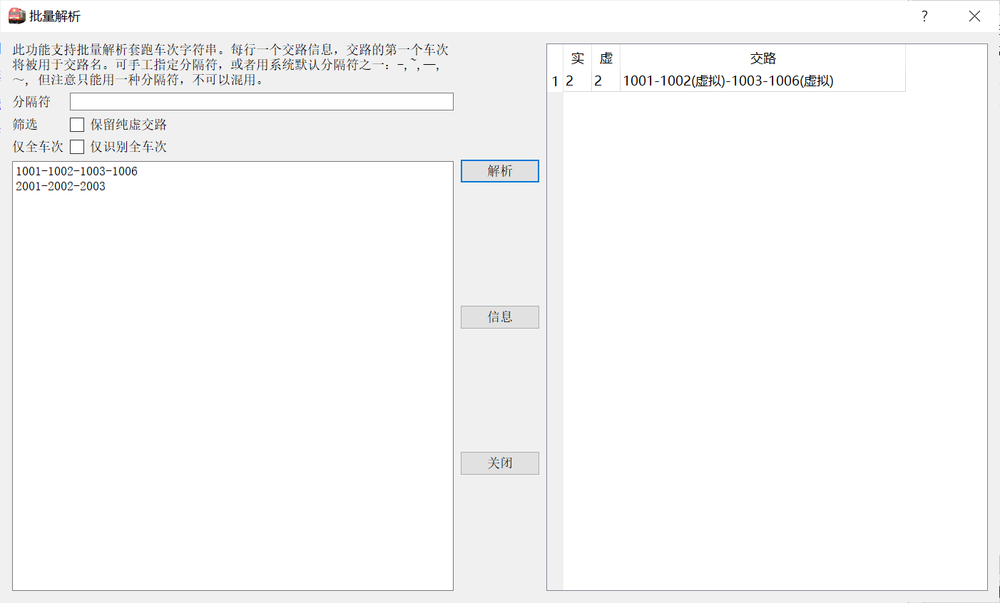

左侧的编辑框中一行是一个交路；点击`解析`后在右侧产生结果。解析的结果立即生效，并添加到交路表中。

`保留纯虚交路`控制是否要保留所有车次都为虚拟车次的交路。如果不勾选，则完全虚拟交路会被排除掉，例如完全不在本线的交路，或者完全重复的交路。作为推论，如果不勾选此项目，则在输入的交路不变、第二次点击`解析`时，产生的结果为空白。

### 交路图

一个交路能够使用交路图功能，用户必须提供足够的数据。具体来说，是当且仅当满足以下条件：

- 交路中不存在虚拟车次。
- 对于交路的车次序列中，**每一对**相邻的车次间，前一车次时刻表最后一站是终到站、后一车次时刻表第一站是始发站，且这两站是同一站（不一定是本线的站）。

点击交路设置对话框底部的`交路图`弹出对话框，如下图所示。

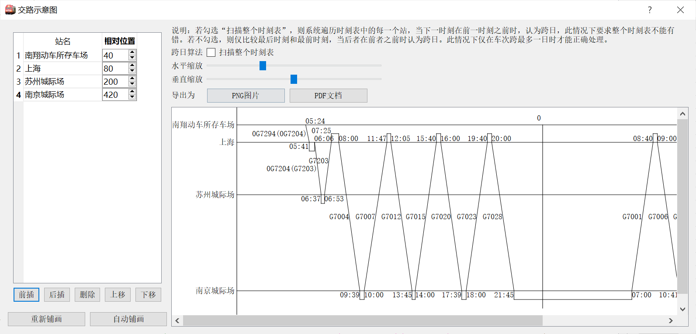

这是按照“中国动车组交路查询”绘制习惯给出的交路示意图，支持调整大小，可导出`PNG`和`PDF`格式。

若不勾选`扫描整个时刻表`，则绘制交路图时，认为每个车次全程运行时长小于24小时，也即至多跨越一天。若勾选，则会遍历整个时刻表，每当发现下一站时刻在上一站时刻之前时，就认为跨越了一天。此种情况下，整个时刻表不能有错误（尤其是顺序错乱的错误）。

系统会自动产生各个车站在纵轴的相对位置。由于实际交路的复杂性，自动产生的位置常常不合理，例如上例中，自动产生的位置是苏州城际场在南京城际场的下方。此时可以手工调整，在左侧表格中输入站名和相对位置。点击`重新铺画`按照表格中定义的顺序重绘交路图；点击`自动铺画`抛弃表格中的数据，而恢复到初始时系统自动给出的位置。

?> 所有输入的站名都会被画在图上，即使这个站实际上没有车始发终到。另一方面，如果站表中缺少某个有始发终到车次的车站，系统会自动补上。

## 列车停站数据

在真实的铁路生产环境中，列车停站有多种情况的分别，例如会让、越行、技术停车（换挂、换乘）、办客、通勤等。在pyETRC的建模中，我们将问题简化为营业停车和不营业停车两种情况。考虑到实际情况，又分为客车和非客车（或者统称为货车）两类。在一般的应用场景下，不大需要处理这一点；但某些情况下可以考虑使用。

### 是否营业及其应用

无论是否是客车，其在某个站是否营业的设定都在`当前车次设置`停靠面板中。勾选为营业，不勾选为不营业。如果营业，则该站的站名变为红色。

在`线路编辑`停靠面板中，有`办客`和`办货`两列，表示该站是否能办理客运业务或者货运业务。

#### 营业自动设置

点击`当前车次设置`页面中右下角的`自动营业`按钮，将按照以下原则重新设置本次列车所有站的营业信息：

- 客车在办客车站停靠则营业，非客车在办货车站停靠则营业，否则不营业。

  ?> 关于是否客车的判定，参见[客货车判定及其应用](#客货车判定及其应用)。

- 始发、终到站一律营业。

菜单操作项`工具->重置所有列车营业站`对所有列车应用以上操作。

通过标尺排图向导（见[按标尺铺画运行线](main/modify#按标尺铺画运行线)）铺画的列车运行线的营业信息也按照以上原则设定。

#### 营业信息的应用

车次停站营业信息主要有以下的应用。

- 在区间对数表和区间车次表中允许按是否营业来筛选车次。参见[区间分析](main/review#区间分析)。
- 在车次时刻表中，可以筛选仅营业车站。参见[列车时刻表](main/review#列车时刻表)。

另外，车站是否办客、办货的信息的主要应用有：

- 在区间对数表中筛选办客/办货车站，以减少干扰项。参见[区间对数表](main/review#区间对数表)。

### 车站股道

在`当前车次设置`停靠面板中，可以设置停站的股道信息。股道可以是任意字符串，股道的匹配依据字符串匹配规则。也即`01`和`1`不会被认为是同一股道。

如果股道信息留空，则认为没有股道数据。

车站股道信息主要用于[车站股道图](main/review#车站股道图)的铺画。此外，在车次时刻表、车站时刻表中也有展示。