# 运行图审阅

本文档主要介绍基于已有运行图的一些数据展示、分析功能，尤其是在不改变运行图数据情况下的分析。当然，运行图数据与分析是紧密联系的，不可能截然的分开。因此出于各种逻辑考虑，有一些分析功能不再本文档中，本文档中也有少量的修改运行图数据操作。

这篇文档基于pyETRC V3.1版本编写。目前已更新至`3.3.2`版本（2021年3月12日修订）。

## 基本数据

在我们的文档中，“基本数据”或者“基础数据”一般指的是任何运行图都会有的、往往还是系统强制需要设置的数据，例如车站里程数据，车次时刻数据等。

### 运行图信息

`运行图信息`功能给出和本线、运行图相关的基本统计信息。为了方便，直接以文本形式给出。通过菜单栏的`查看-运行图信息`，或者新版工具栏的`线路-运行图信息`可以打开。以下是一个示例输出。

```
线名：京沪线上局段
文件名：D:/京沪线上局段.json
里程：685.0km
起点站：利国
终点站：上海
站点数：82
车次数：797
下行车次数：395
上行车次数：402
```

### 列车信息

与`运行图信息`相对应，我们提供了`列车信息`功能显示车次的基本信息，及车次主要操作的导引。

?> 这个功能设计成**只读**的，从这个界面不能直接修改车次数据和时刻表，但提供了导向时刻表和编辑界面的快捷操作。设计中，可以作为**常开**的停靠面板。

通过快捷键`Ctrl+Q`、菜单栏`窗口->车次信息`、工具栏`列车->信息`可以打开或关闭。界面如下图所示。

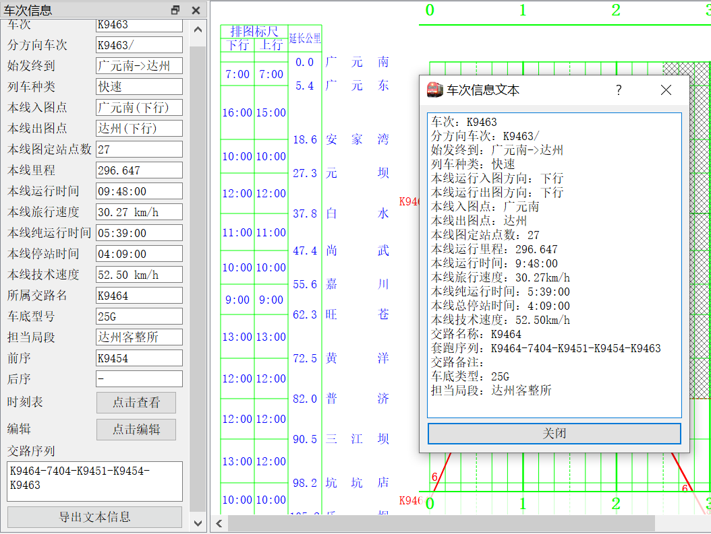

点击`时刻表`弹出[列车时刻表](#列车时刻表)面板；点击`编辑`弹出`当前车次设置`面板。点击`导出文本信息`显示上图所示的对话框。这实际上是旧版的车次信息功能，文本中包含的信息与面板中一致。

### 列车时刻表

为了更**方便**和**安全**地查看列车时刻表，比照ETRC的时刻表，本系统提供了**只读**的列车时刻表（但只是单个车次的时刻表，而不是全局的），也是设计成常开的停靠面板。通过以下任一方法可打开此面板：

- 快捷键`Ctrl+Y`
- 菜单栏`窗口->车次时刻表`
- 工具栏`列车->时刻表`（大图标）
- 双击车次运行线

为了减少水平空间的占用，时刻表采用双行的设计。界面如下图所示。

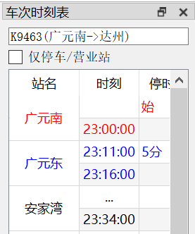

文字颜色的规定与`当前车次设置`中一致，即红色字表示该站营业、蓝色字表示停车但不营业、黑色表示其他。

### 标尺一览表

**此功能自`3.1.2`版本开始添加**。

本系统在`标尺编辑`停靠面板中提供了对标尺数据的完整查看和编辑。但标尺编辑界面一方面不方便对比不同的标尺，另一方面容易误触，基于此考虑，`3.1.2`版本开始提供特定格式的、**只读的**标尺一览表功能。此功能位于菜单栏`查看->标尺一览表`，工具栏`线路->标尺一览`，或快捷键<kbd>Ctrl</kbd>+<kbd>7</kbd>。界面及其图例如下图所示：

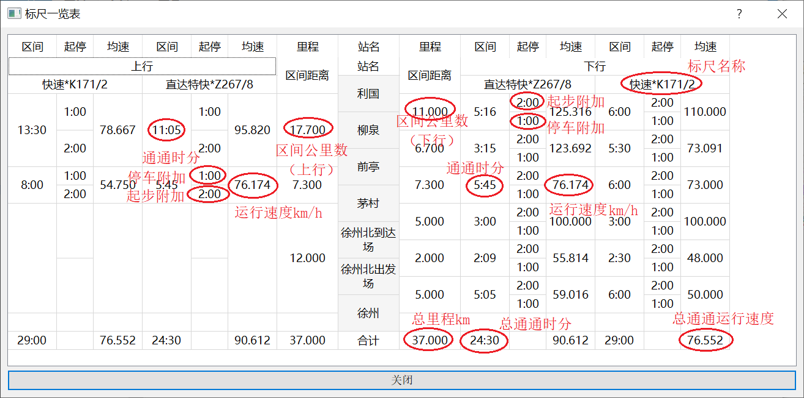

表格主要按列组织。中间加背景色的是站名列，左边属于上行，右边属于下行；站名列左右两列是区间里程，再往外每三列属于同一个标尺（的一个方向），标尺的排序按照对称的原则。

?> 以上所示是`3.1.3`版本的布局。`3.1.2`版本的布局与此不同。

## 车站分析

注：自`3.3.2`版本开始，车站时刻表和车站股道图功能支持同一车次经过指定车站不止一次的情况。

### 车站时刻表

车站时刻表功能提供了针对车站的、以车次为单位的时刻表，并尽量展示了与车次及其停站相关的数据。从菜单栏`查看->车站时刻表输出`、工具栏`线路->车站时刻`（大图标）或者快捷键`Ctrl+E`可以调出。在弹出的对话框中选择车站，然后看到以下对话框：

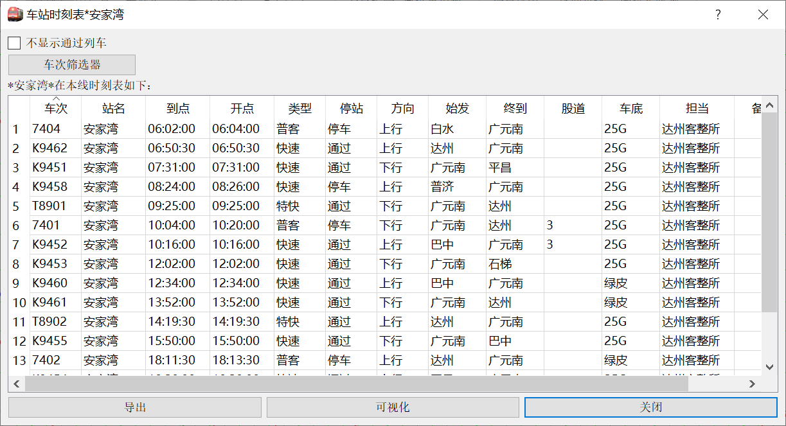

其中，`导出`可以将以上表格数据导出到Excel表中。`可视化`将调出[车站股道图](#车站股道图)功能。表中可以对各列排序。

### 车站股道图

在[车站时刻表](#车站时刻表)中选择底部的`可视化`打开本功能。本功能提供车站股道安排的图形化表示。既可以使用用户提供的股道数据，也可以使用系统按照特定算法排出的股道。自然，本系统排出的结果仅供参考。本功能的界面如下图所示。

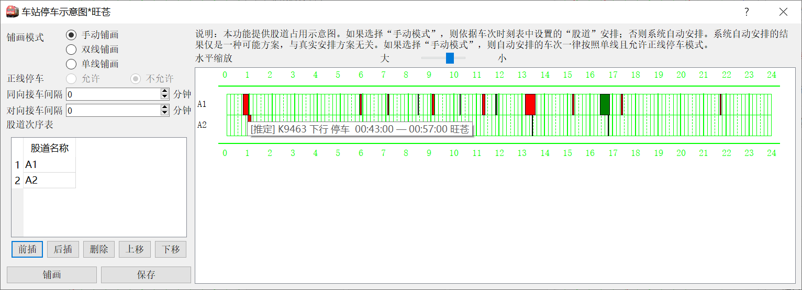

右侧图中的横轴为时间（与运行图中一致），纵轴每一格（即每一行）为一条股道，每一个色块表示一个车次在本站占用股道的时间段。色块的颜色由车次运行线的颜色决定（如果是交路接续，以后车为准）。

对于通过的车次，其股道占用时间一般按照1分钟处理。

将鼠标放在车次色块上可以看到车次停车的具体信息。其中，`[推定]`表示该车次的股道信息由本系统推定给出，`[图定]`表示该车次的股道信息由用户输入。车次股道信息的编辑请移步`当前车次设置`（`ctrl+I`）面板。

左侧的设置项将分成下面几个子目分别介绍。

#### 铺画模式和自动铺画逻辑

在左侧的`铺画模式`栏目设置。其中，`手动铺画`表示应用车次设置的股道信息来铺画，而没有股道数据的，按照**单线、允许正线停车**模式来自动安排。另外两项都不使用用户设定的股道信息，而完全由本系统的逻辑来安排股道。

各种铺画模式下的股道名称及其意义为：

- **单线铺画**。车站股道为`Ⅰ, 2, 3, ...`。其中`Ⅰ`道为**正线**，其他为侧线。

- **双线铺画**。车站股道为`..., 3, Ⅰ, Ⅱ, 4, ...`。其中`Ⅰ`、`Ⅱ`道分别为下行、上行的正线，其他单数股道为下行侧线，双数股道为上行侧线。这种模式多见于新建客运专线中间站。

- **手动铺画**。首先使用车次数据中的股道信息，建立所有车次中出现的所有股道。对于没有股道信息的车次，首先在已有股道中安排，如果股道不够用，则新建股道名称为`A1, A2, ...`。对于车次中的股道信息，本系统以**字符串匹配**方式进行匹配，这就是说，`1`和`01`将指向不同的股道。

  ?> 手动铺画模式强制按照用户给出的股道安排，即使出现冲突；如果出现冲突，将弹出警告信息。

自动铺画时，对于每一车次，系统先行查看所有既有股道是否能接发该次列车（如果允许`正线停车`，则从正线开始，否则从第一侧线开始），如果有则安排到第一个能接发的股道，否则新建股道。

`同向接车间隔`是指，同一股道上，同行别的两车次，只有前车出发时间和后车到达时间之间的间隔大于或等于设定值时，这样的安排才是有效的。`对向接车间隔`则相应指不同行别的两车次，且只适用于单线铺画模式下。

默认情况下两个接车间隔都为0，即只要两车次占用股道时间不重叠，即可接发。

#### 股道顺序安排

左侧的`股道次序表`可以指定各股道名称，及其（在图上从上到下的）安排次序。**此设置仅在`手动铺画`模式下有效**，自动铺画时，股道全部由系统自动安排。

点击`保存`可以将当前表中的股道顺序安排表保存到线路数据中，此项操作随着运行图文件的保存而永久保存到文件。下次打开时，首先加载线路数据中的股道表。点击`铺画`可按照上面设置的铺画模式、股道表来重新铺画股道分布图。

股道次序的安排遵循如下规则。

- 在`手动铺画`模式下（启动时默认是这样的），如果线路数据中有股道信息、或者用户已经设置过股道信息然后点击`铺画`，则系统首先将股道信息表中的股道按顺序安排（即使有的股道并没有图定车使用，也会安排）。

- 如果有的车次停站信息中的股道不在股道表中，则在后面追加该股道。增加股道的顺序是不确定的（事实上，取决于扫描车次的顺序）。

  ?> 例如，如果某站股道表为`Ⅰ, 2, 3`，某车次在该站停靠股道为`1`，则该股道不在股道表中，股道信息将变为`Ⅰ, 2, 3, 1`。我们再次强调，股道匹配是按照**字符串匹配**的原则进行的。

- 对于没有股道信息的车次，系统将尝试安排到既有股道；如果既有股道都不能安排该车次，则新建股道，新建股道命名格式为`A1, A2, ...`。

- 在手动铺画模式下，如果没有输入的股道次序信息（即：线路信息中的股道次序表，或者用户指定的股道次序表），则将所有车次信息中的股道添加到股道表后，进行一次**基于字符串比较**的排序。

?> 我们看到，对于按照车次提供的股道信息和系统自动安排股道的混合情况，系统的处理是不可靠的。因此，我们建议，如果要使用手动铺画，请尽量提供**完整的信息**。

#### 交路接续逻辑

作为[车底交路](main/data#车底交路)功能的开发目的之一和重要用途，在股道占用分析中，无论自动铺画还是手动铺画，都将利用交路信息。

##### 设计背景

在正式说明交路接续的逻辑之前，我们先介绍一下此功能的设计背景及以往的解决方案，或者也可以说是替代方案。如果不希望花时间了解这些细节，可跳过本节。

在运行图中，各个车次是独立的。对于始发终到的列车，一般始发站不存在到达时刻，终到站不存在出发时刻（虽然本系统还是保留了这两项数据），但一般来说始发终到站的到开时刻是一样的，在股道分析、事件分析时，和通过站的结构差不多。即使在本系统引入了始发终到站的字符串匹配方法后，可以将它们和通过区分开，但还是无从得知始发终到站的股道占用时长。很显然，在实际情况，始发车总是有前序车次（或是出库，或是上一终到车次），车底总会占用一定的股道；终到车亦然。

默认情况下，虽然识别出了始发终到信息，但由于没有更多信息，系统仍按`通过`处理，即占用股道1分钟。但这显然是不合实际的；一般需要使用股道分析的站都是大站，会有较多始发终到的情况，这使得本功能的可用性大大降低。

在引入交路功能之前，有一种**替代方案**，即利用终到车次的`出发时刻`，将其设为后序车次的始发时刻，或者反过来，将始发车次的`到达时刻`设为前序车次的终到时刻。这样虽然能一定程度解决问题，但仍有以下问题或者困难（以下我们以修改**终到车次**时刻的方案为例探讨）：

- 手动输入时刻工作量较大，且容易出错。
- 影响车次在本线运行的时间、均速等参数的计算。
- 终到车次的终到标签与实际终到点距离较远，影响看图。
- 大站有大量车次始发终到，则该站水平线上总是有较多的车次运行线叠压，影响看图。
- 接续的两个车次仍为独立的，仍然会作为两个独立车次安排股道；在自动铺画中，并不能保证两车次被安排到同一股道（一般情况下，就是不在同一股道上），造成多余数据的干扰。这也是**最严重和最本质的一点**。

##### 逻辑和显示

以上介绍了此功能设计的背景。下面说明具体的展示形式和逻辑。

两车次被判定为接续车次，**当且仅当**满足[运行线连接](main/data#运行线连接)的条件。这就是说，交路接续所占用的股道，可以理解为运行图中连接运行线的虚线占用的股道。

当车次连接时，其车次在图上将标注为`交路接续`，并且其行别按照**后续车**行别来处理。例如，在下图中，画圈的三处所指的是同一件事，即两车次的接续。

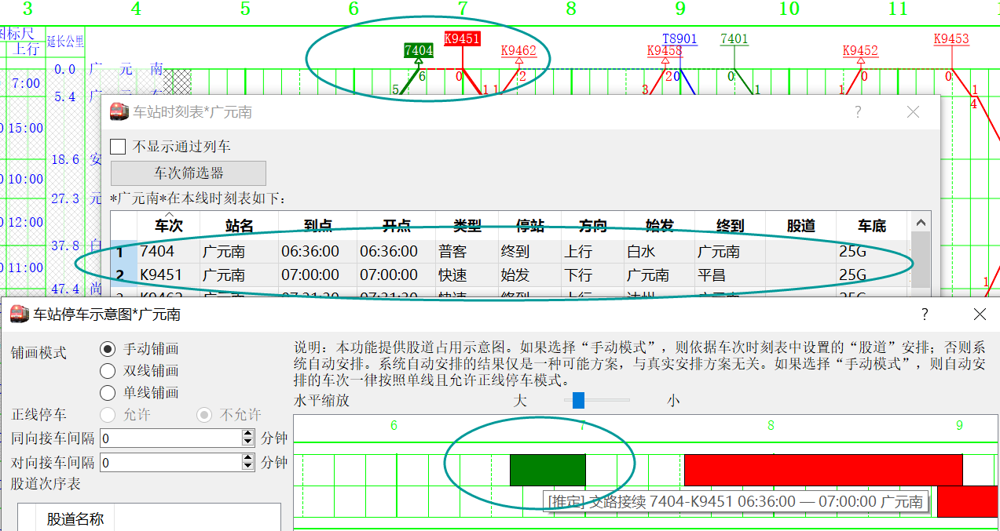


## 区间分析

我们这里说的`区间`，是指两个车站之间，特别是本线的两站之间的区间。但本系统只检查点对点的数据，而不关心两点之间是否经由本线运行。

### 区间对数表

区间对数表功能统计本线各个区间的的车次数量，以单源点或者单阱点的形式展示。菜单栏为`查看->区间对数表`，快捷键为`ctrl+3`。示例界面如下图所示。

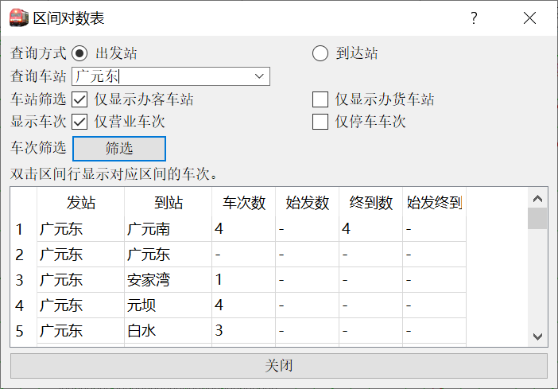

选择`出发站`时，查询所选车站到符合条件的各个车站的符合条件车次数；选择`到达站`时，则查询符合条件的各个车站到所选车站的符合条件的车次数。

通过`车站筛选`可以选择是否只显示办客车站或者办货车站。关于车站办客/办货与否的设置，请打开`线路编辑`(`ctrl+X`)面板。此选项便于减少干扰项，只显示需要显示的。

`显示车次`选项控制是否只统计在指定区间端点两个站营业或者停车的车次。注意，作为特别处理，**始发、终到总是被作为停车处理**，即使始发终到站的时刻表到开时刻可能（并且往往）是一样的。

`车次筛选`将调用[通用车次筛选器](#通用车次筛选器)进一步筛选统计范围。

表中`车次数`一列的数据，是指从该行`发站`至`到站`区间的，符合`显示车次`筛选条件、符合车次筛选器筛选条件的车次的数量。`始发数`一列指的是`车次数`所指的一组车次中，在`发站`始发的数量，`终到数`是类似的；`始发终到数`则是指在`发站`所示站始发**且**在`到站`所示站终到的车次的数量。如果数据是0，则显示为`-`。

本功能计数时**并不**检查车次在发站、到站之间，是否经由本线运行。本功能仅限查询本线车站。

?> 双击表中的一行，可以查看该区间的[区间车次表](#区间车次表)。

### 区间车次表

类似于12306的查询区间车次，本系统设计了区间车次表功能，显示指定区间的具体车次及其相关信息。菜单栏位于`查看->区间车次表`；快捷键为`ctrl+shift+3`。主界面如下图所示。

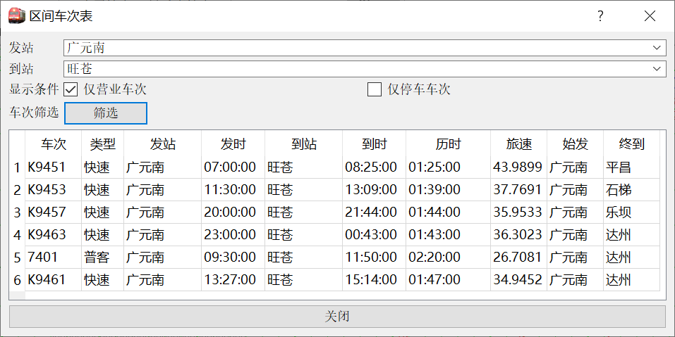

`发站`、`到站`栏选择或输入要查询的车站。可以在下拉框中选择本线的车站，但本功能的查询**不限于本线车站**。

`仅营业车次`选项控制是否只显示在`发站`、`到站`都营业的车次；`仅停车车次`是类似的。需注意始发终到也被视作停车。

### 区间性质计算

在[列车信息](#列车信息)一节中，我们给出了关于某车次在本线的一些运行数据，诸如区间均速等。确切的说，是车次在本线各段运行线的数据的综合。但有时，我们可能还需要知道车次在本线**任意区间**的运行数据，为此设计了这个功能。菜单栏功能见`查看->当前车次区间性质计算`，快捷键为`Ctrl+Shift+Q`，工具栏见`车次->区间分析`。弹出对话框如下图所示。

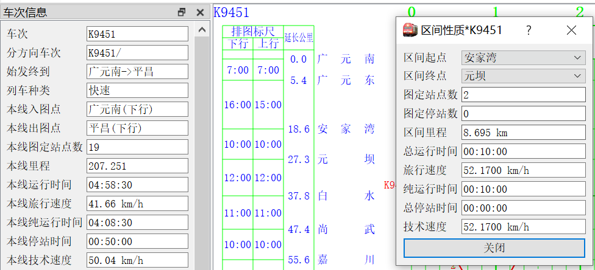

选择区间起点、区间终点即可查看数据。需说明，起点、终点**仅限本线站点**。

?> 本功能给出的数据是**区间起点出发-区间终点到达**的数据，也即不包含起点、终点的停车时间，也不算入总运行时间、旅行速度。

## 列车时刻分析

列车时刻分析，指的是对列车时刻表各个区间数据、各个车站停点等的分析。

### 标尺对照

以前的文档中曾经说过，**列车与标尺之间不存在一一对应关系**，但本系统提供了标尺对照功能，可以将当前车次运行数据与**任一**本线的标尺进行对比，显示标尺的差异程度，从而为判断车次属于/接近于哪个标尺，提供判断的依据。当然，目前为止，这个判断还需用户自行完成，本系统不会做出判断。

当本线存在至少一套[标尺数据](main/overview#标尺数据)后，可以使用本功能。菜单栏位于`查看->当前车次标尺对照`，工具栏位于`列车->标尺对照`，快捷键为`Ctrl+W`。展示的对话框如下图所示。

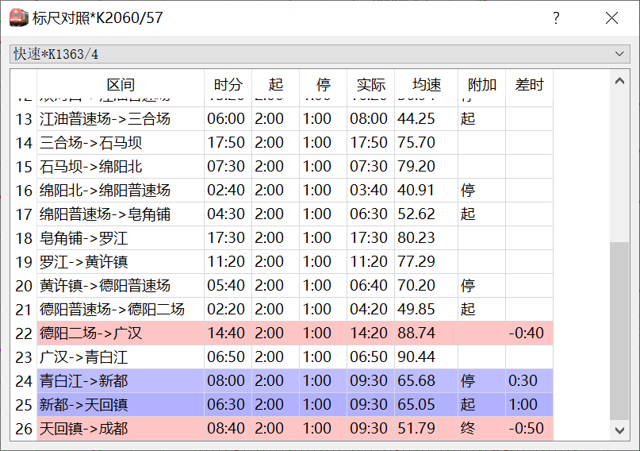

表格上方可选择使用何种标尺对照，下方则是各个区间的数据及其对照。`附加`一栏有`起`或者`始`表示本区间存在起步附加时分（因区间前站停车或者始发），有`停`或者`终`表示存在停车附加时分（因区间后站停车或者终到）；未说明则表示没有该项附加时分。

`差时`一栏是**实际运行时分减去标尺运行时分**（已考虑起停附加），形式为`分:秒`。如果实际运行时分小于标尺运行时分（即实际比标尺快，`差时`为负值），则背景色为红色，且**相对**差时越大，颜色越深；反之为蓝色。

### 两车次对照

在有标尺数据的情况下，检查列车的区间运行情况，一般用标尺对照功能就足够了。但有时，因为用户习惯或者实际情况，不适合引入标尺数据，此时可以考虑使用两车次对照功能。此功能不依赖于标尺数据，而是直接将两车次的运行数据进行对照。菜单栏位于`查看->两车次时分对照`；快捷键为`Ctrl+Shift+W`；工具栏位于`列车->车次对照`。

?> 需要说明，本功能从效果上来说，应该是**弱于**先从一个车次抽取标尺，再与另一车次对比的做法。原因是没有引入标尺，也就没有**起停附加时分**的数据，对于两车次区间起停状况不一样时，本系统无从得知起停附加时分，因此只能列出，而不做起停附加时分运算。

界面如下图所示。

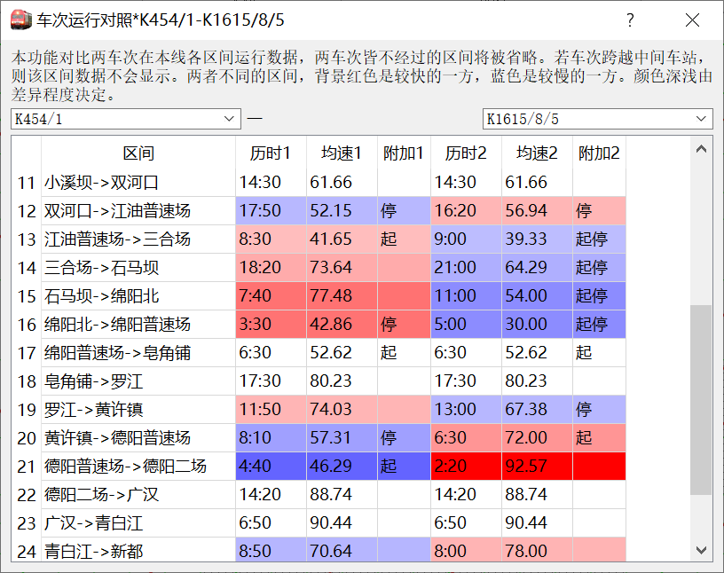

在上方左右两侧选择两个车次，表中即展示数据。其中`附加`两列的略语含义同[标尺对照](#标尺对照)中所述的。如果两车次运行时分不同，则快的一方是红色，慢的一方是蓝色背景，且颜色深浅正比于相差时分的相对大小。

?> 考虑到两车次的运行区间可能不完全一样，本功能是**依照线路数据**，先下行再上行地遍历所有线路区间，对于两车次至少有一个车次经过的区间展示出来。这就是说，如果两车次运行区间完全不重叠（一般来说，是上下行相反），两车次的数据会分别展示，但不会对比。缺数据的一边，用`-`占位。

### 运行图对比

自`2.3.2`版本，为了解决不同时期运行图快速对比的问题，本系统新增了运行图对比的功能。一种典型的用法时，在两次**调图数据**之间比较哪些车次、哪些车站的数据发生了变化。本系统将本运行图视为“当前运行图”，选择的另一运行图视为“新的运行图”，因此本图有而新图没有的标记为`删除`，反之标记为`新增`。

菜单栏`工具->运行图对照`，工具栏`线路->运行图对比`，快捷键`Ctrl+6`可以打开本功能，界面如下图所示（首先看到的是左边对话框）。

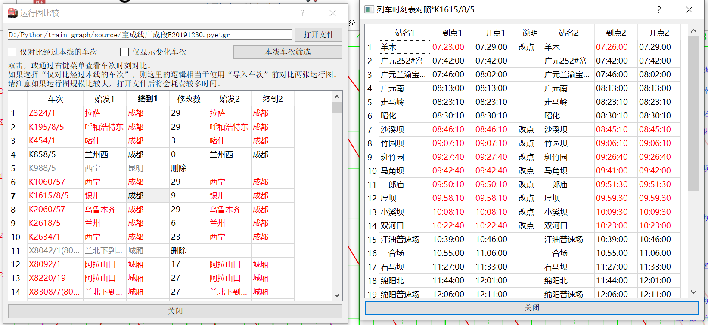

选择运行图文件即看到左边的对比结果，可以对车次进行一些筛选。注意，`本线车次筛选`调用通用车次筛选器，其筛选**仅作用于本图车次**，不作用于另一运行图的车次。

?> 选择运行图后需要进行大约几秒钟的计算。本系统使用**动态规划**算法，在**选择运行图之后立即**计算所有车次的对比，而非在点开车次对比时才计算。计算的时长，取决于**两运行图共有车次的数量和共有车次时刻表长度**（时刻表站点数），与总车次数关系不大。

在车次对照表中，**本系统只依据全车次进行车次匹配**，也即如果某列车改了车次，将被判别为一个删除车次、一个新增车次。对于修改的车次，以红色字体标出，并在`修改数`一栏填入时刻变化的**车站**数目；对于本运行图有、另一运行图没有的车次，标记为`删除`，并用灰色字体；对于本运行图没有、另一运行图有的车次，标记为`新增`，并用蓝色字体。

双击表中非删除、新增车次的行，或者用右键菜单，可以打开车次对比表，如上图右侧对话框所示。与车次列表的无序性不同，**车次时刻表是有序的**，这意味着（极端情况下）仅仅是时刻表顺序的对换也应当视为时刻表变动。为此，本系统采用动态规划算法进行对比，寻找两时刻表最短“编辑距离”的配对方式进行比较（“编辑距离问题”是一个经典的动态规划算法问题，要了解具体的问题定义和算法，可以借助搜索引擎）。时刻表中两个车站的数据有`新增`、`删除`、`改点`、`改名`四种注解；如果不变，则略去。其中，`改名`是指配对的两时刻表中对应车站，到发时刻一样，只有站名不一样，这种情况下认为**可能**是站名发生改变；另外三种情况与车次对照表一致，无需赘述。

### 车次事件表

所谓车次事件表，指的是某车次在**本线**运行时发生的到达、出发、通过、会车、越行、待避等事件的时刻表。本系统比照ETRC中的“车次切片”功能设计了车次事件表功能， 亦可称为“车次切片”。本功能是针对“选中车次”设计的，因此需要先选中指定车次运行线，再通过以下任意方式打开本功能：

- 菜单栏`查看->当前车次事件表`。
- 工具栏`列车->事件表`。
- 运行图区域右键菜单`车次事件表`。
- 快捷键`Ctrl+Z`。

本功能的界面如下图所示。

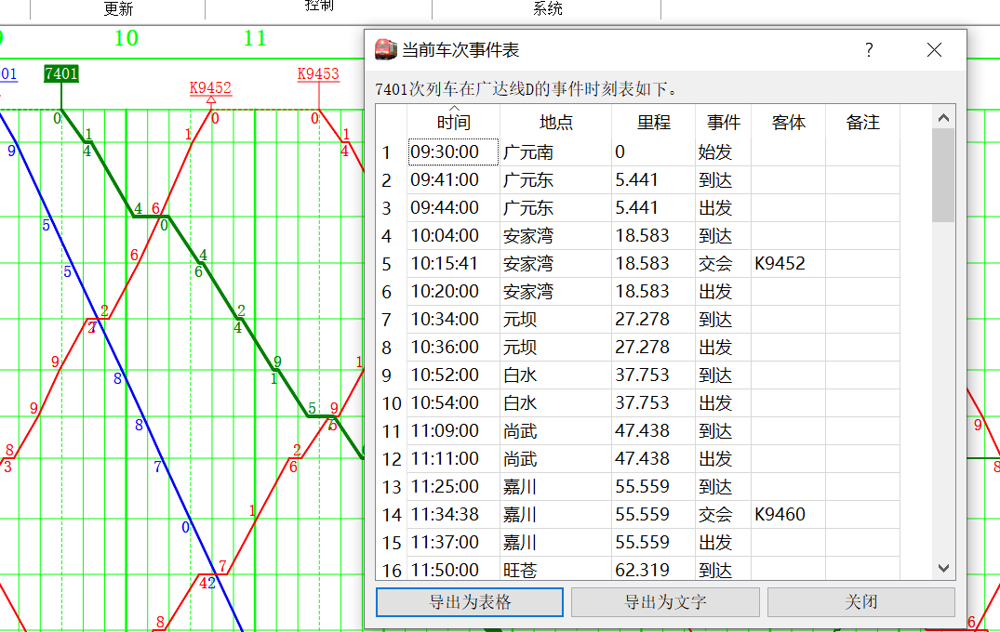

事件表支持导出为Excel表格，或者类似ETRC风格的说明文本。

需要说明的是，与ETRC基于时刻表数据计算不同，本系统的多车次事件是基于**运行线交叉点**进行计算的。这将导致：

- 有的情况下，对于站内站外的判断不大准确。
- 未铺画的车次可能（往往就是）不会被显示出来。
- 未显示的车站的站内事件可能无法识别。
- 事件时刻可能出现至多几秒的误差，比如显示的同一车次在同一车站的通过时刻和越行时刻有一点差别。

同时，需要说明，这个功能是本系统**最不完善**的功能之一。除了以上的问题外，还有

- 事件的排序有时候不准确。

  ?> 事实上，应该说很难找到一个简单的排序方法。如果简单的按照时间排序，则如果出现**跨日**车次，顺序将错误；更严重的是，如果车次在本线运行时间超过24小时，将出现交叉。如果简单地按照里程排序，则当车次在本线有折返情况时，顺序会出错。目前还没有找到合理的解决方案。

- 计算事件表需要的时间较长。

  ?> 事实上，最主要的时间都花在Qt库计算交叉图元上，程序逻辑的后续计算耗时很少。这也导致这个时间很难优化。

- 虽然再历次更新中陆续解决了一些系统性的错误，但偶尔可能还是会出一些错误，并且很难排查。

这些问题目前都没有找到合适的解决方案，可能短时间内无法优化，请用户注意规避。


## 显示与查找

有时运行图上车次很多，但我们其实只关心其中的一部分车次。一种典型的情况是，我们只想看旅客列车运行线；或者在车次列表（例如，车站时刻表）上，只关心某些车次；或者想快速找到某车次运行线。为此本系统设计了车次筛选和查找的相关功能。

### 通用车次筛选器

读者可能已经注意到本节已经很多次被文档的其它部分引用。虽然再某些地方可能存在特殊需求，但本系统中的列车总是有一些共有性质的，例如车次名、列车种类等。本系统提供了针对这些特征的统一筛选方式，称为**通用车次筛选器**，或简称为车次筛选器。各种列出车次的场合，类似“筛选车次”的按钮通常都指向本功能。

车次筛选器的对话框主界面如下图（左）所示。

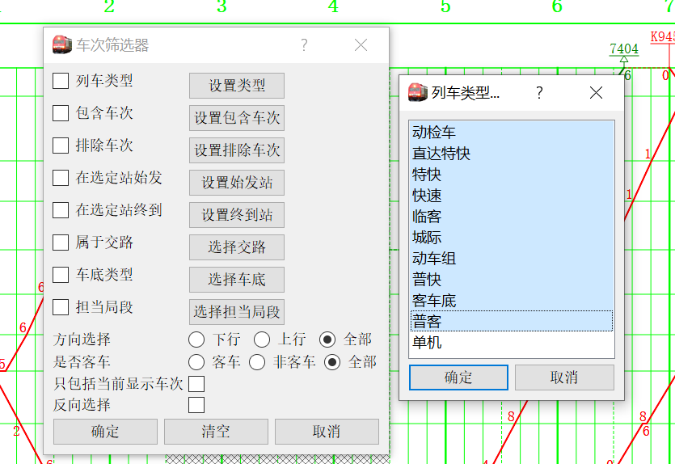

上方从`列车类型`到`担当局段`的共计8个项目的操作方式都是类似的。名称前方的勾选框指示是否启用此选项，点击后面的按钮弹出具体的设置对话框。

!> 只有勾选了的选项才会产生效果；如果没有勾选，则应用更改后，设置内容可能会丢失。

其下的四个选项标注得比较清楚，不再具体说明。

点击`确定`后应用筛选器到要筛选的地方；点击`清空`清除所有条件（设置所有车次都被选中），并立即应用；点击`取消`关闭对话框，放弃当前修改。

?> `反向选择`选项相当于对前面的**总结果**进行取反。没有勾选的项目，将认为所有车次**都通过**该项的筛选。

?> 不考虑`反向选择`的前提下，`包含车次`和`排除车次`两个选项的优先级最高。再排除这两个选项后，其他选项都是**且**的关系。

每个需要用车次筛选器的地方都**独立的**有一个筛选器对象。这就是说，不同作用的车次筛选器之间是独立的、不互相影响的。

下面对部分选项做（必要的）进一步说明。

?> 我们反复强调，**上下行不是车次的性质**，而只是一个区间的性质。在这里我们简单的直接讲车次的上下行其实是不合适的；准确的说，我们实际上指的是**入图时的方向**。这里算是对旧版本的遗留问题的一个模糊处理。

#### 类型、交路、车底类型、担当局段

这几个选项是类似的，因为它们都是多选、且不可输入的选项。其界面如上图右侧对话框所示，多选（按住`Shift`选择，或者选择后拖动鼠标），点击`确定`后即可选中一组对象。

?> 如果不选择选项，但勾选了启用相应的筛选条件，则相当于**排除所有车次**。一般来说，这种方式配合**包含车次**使用，可以只筛选指定形式的车次。

#### 包含车次、排除车次

这两个选项的设置界面是一样的，如下图（右侧）所示。

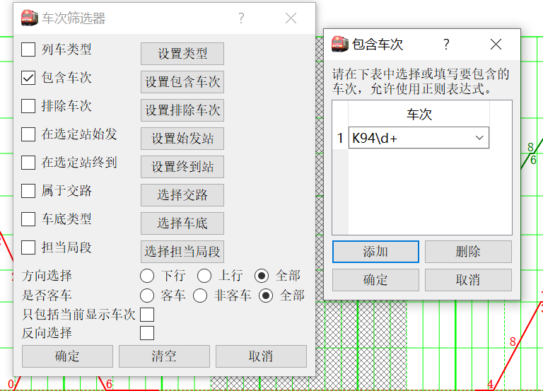

点击`添加`、`删除`添加选项。注意车次可以使用**正则表达式**（Regular expression）以扩大范围。

?> 关于正则表达式的语法，请借助搜索引擎查找。另外，如果不用正则表达式，而是直接输入或者选择车次，也是合法的。

!> 这里再次强调，包含车次、排除车次具有高于其他选项（除了`反向选择`之外）的逻辑优先级。

#### 在选定站始发、终到

这两个选项的设置界面是一样的，如下图（中）所示。

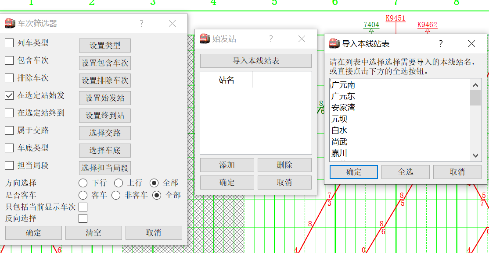

除了可以手动输入外，还可以直接导入本线的全部或者部分站表。

#### 应用举例

这里列出可能的、比较特殊的应用情况。今后如遇到新的例子，还可能补充。

---

【**例1**】筛选所有跨线表达式。

我们这里定义**跨线车**为不在本线始发**或**不在本线终到的车次，即

```python
not 本线始发 or not 本线终到
```

按照德摩根定理，可以转换成：

```python
not (本线始发 and 本线终到)
```

因此，依次设置三个选项：

- 勾选`在选定站始发`，在设置对话框中导入本线所有站点。
- 勾选`在选定站终到`，在设置对话框中导入本线所有站点。
- 勾选`反向选择`。

再点击`确定`即可。

---

### 显示车次筛选

本系统提供两种基本方法来设置要显示的列车的种类。具体的显示逻辑可能比较复杂，但面向应用来说，往往不大需要搞清楚。

#### 快速筛选

快速筛选类型是本系统早期版本就带有的功能，以停靠面板方式实现。快捷键<kbd>Ctrl</kbd>+<kbd>L</kbd>，菜单栏位于`窗口->显示类型设置`。其界面如下图所示。

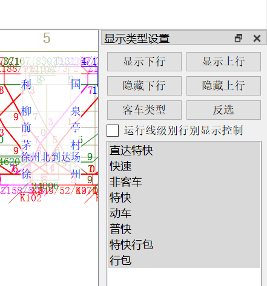

可以在表中选择一部分类型，然后点击`确定`，此操作的效果是，所有车次显示运行线**当且仅当**其类型为选中的类型。

?> 这看起来像一句废话，但其实不尽然。在[列车基础数据](main/overview#列车基础数据)中，可以单独设置任一车次是否显示运行线。在这种情况下，使用此功能，将导致这些特殊设置的数据丢失。

`显示下行` `隐藏下行` `显示上行` `隐藏上行` 几个按钮在点击后**立即作用**。其中，`显示xx`的按钮，将使得所选方向的**所选择类型**车次运行线显示在图上。关于行别的具体说明参见[通用车次筛选器](#通用车次筛选器)一节。

**`3.1.2`版本更新**（图片已经同步更新）：新增`运行线级别显示控制`选项。如果启用，则车次运行线只显示一部分。在此情况下，当点击`显示下行`时，**所有下行运行线**（即使只是某一车次运行线中的某一端）都会被显示。如果不启用，则行别显示控制按钮**按照入图行别**控制。

?> 已知问题：启用运行线级别的控制时，点击`隐藏下行`可能不能隐藏所有下行运行线，涉及本线变行别车次时，其上行部分运行线仍可能被显示。特别的，连续点击`隐藏下行`和`隐藏上行`并不能隐藏所有运行线。

?> 需要说明，与ETRC不同，行别显示与否是**不具有状态**的。这就是说，上述四个按钮仅在按下时发生作用；譬如连按两次`显示下行`，第二次按将无效。这样设计的原因是，由于本系统支持调整个别车次运行线是否显示，而且新的版本中还可以用高级筛选的方法调整显示车次，使得即使用户上一次点击了`隐藏上行`，系统也没办法说，“上行车运行线都处于显示状态”。分列车种类的显示其实也存在这个问题，但作为一种妥协出现，毕竟不可能对每一个类型都设置两个按钮。

`客车类型` `反选`两个按钮是针对下方表格的。点击后会改变下方的选择，但不会直接确认。


#### 高级筛选

在添加[通用车次筛选器](#通用车次筛选器)模块后，本系统相应提供了利用筛选器来控制运行线显示与否的逻辑。通过`调整->高级显示车次设置`，或者快捷键<kbd>Ctrl</kbd>+<kbd>Shift</kbd>+<kbd>L</kbd>可以打开。其筛选逻辑与参见前文。

### 车次查找

为了能根据指定车次迅速查找出运行线和相关信息，本系统提供了车次查找功能。按查找逻辑的不同，分为两种情况，即精确查找和模糊查找。

#### 精确查找

精确查找是指，**完整输入**一个车次的全车次或者分方向车次之一。本系统假定，输入的车次**至多只有一个匹配项**。如果有多个，则只考虑第一个结果。

例如，输入如果有车次`K2618/5`，默认情况下，分方向车次会识别为`K2615`和`K2618`，此时输入前面三者之一，都可查找到该车次；但如果输入`2615`等，则**不能**查到。

以下方式调出的查找，都是这种精确查找：

- 快捷键`Ctrl+F`。
- 菜单栏`工具-搜索车次`。
- `车次编辑`停靠面板顶部的车次查找输入框。
- 工具栏`列车->搜索`。

#### 模糊查找

模糊查找是指，输入一组字符串，只要该字符串包含于全车次或分方向车次中，即将其列为候选车次，用户可以从候选车次中选择一个需要的。一般情况下，`K198/5`这样形式的车次，输入`198`来直接查找，会比较方便。

如果候选车次只有一个，则直接选中该车次；如果多于一个，则显示列表，用户选择具体是哪一个；如果没有符合的，弹出警告。

此功能可以通过菜单栏`工具->模糊检索车次`，工具栏`列车->搜索(长按)->模糊检索`，快捷键`Ctrl+Shift+F`调出。

